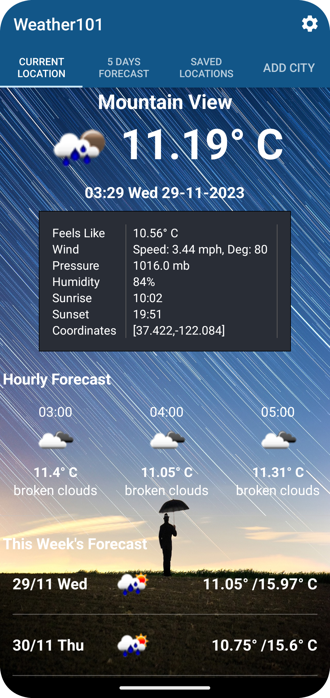
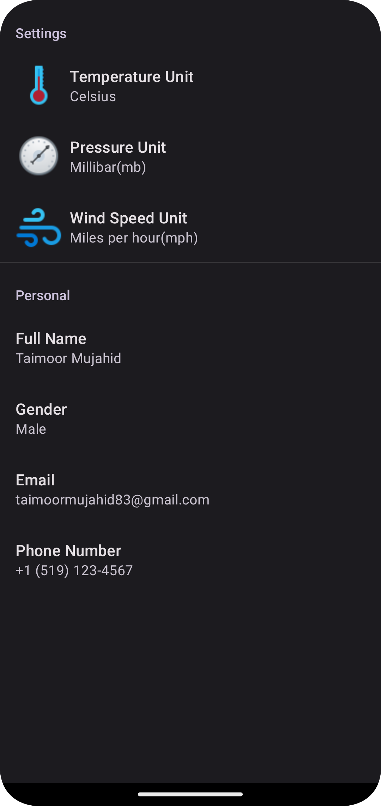
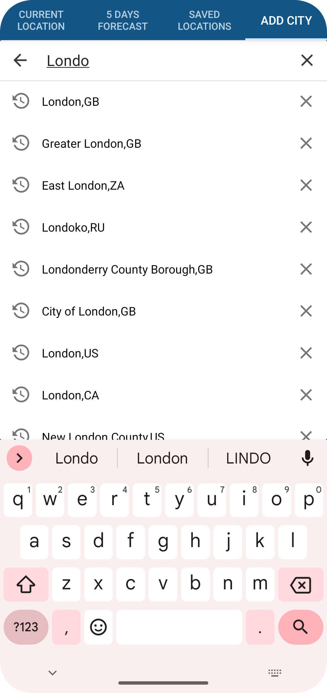
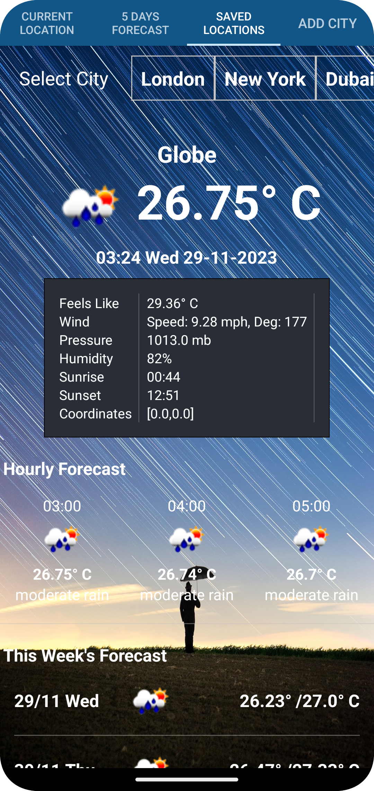

# Weather101 App ☀️🌧️

Welcome to Weather101, your go-to Android app for real-time weather forecasts! 📱⛅

  

## Features

- **OpenWeather API Integration:** Utilizes the OpenWeather API with Retrofit library for accurate and up-to-date weather data.

- **Room Database:** Employs Room Database to save and manage searched places, providing a personalized and efficient user experience.

- **Comprehensive Forecast:** Offers current location weather forecasts, along with hourly, daily, and weekly weather predictions.

- **City Search:** Allows users to search for weather forecasts in different cities worldwide.

- **Preferences Setting:** Customizable preferences for temperature units (Kelvin, Fahrenheit, Celsius), wind speed units (mph, kph, m/s), and pressure units (mb, Pascal, atm).

## Technologies Used

- **Java Programming Language:** Developed using Java for robust and efficient functionality.

- **Retrofit Library:** Utilizes Retrofit for seamless data fetching from the OpenWeather API.

- **Room Database:** Implements Room Database for efficient storage and retrieval of searched places.

          

          

## Getting Started

To get started with Weather101:

1. Clone this repository to your local machine.
2. Open the project in Android Studio.
3. Run the app on an emulator or a physical device.

## Usage

- Access real-time weather forecasts for current locations and searched cities.
- Customize preferences for temperature, wind speed, and pressure units.
- Plan your activities with comprehensive hourly, daily, and weekly weather predictions.

## Contributing

Contributions are welcome! If you'd like to contribute, please follow these steps:

1. Fork this repository.
2. Create a new branch for your feature or bug fix.
3. Commit your changes and submit a pull request.

Stay weather-ready with Weather101! 🌦️☔ #Weather101 #AndroidApp #Java #Retrofit #RoomDatabase
